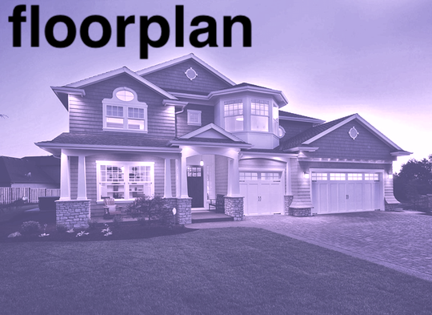
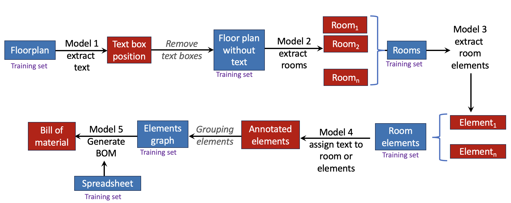

### Patrick Nicolas - Last update 08.04.2023
    





The objective is this repository is to evaluate various techniques to extract and organize information from a floor plan

## References 
- [Room Classification on Floor Plan Graphs using Graph Neural Networks.pdf](https://arxiv.org/pdf/2108.05947.pdf).  
- [Parsing Line Segments of Floor Plan Images Using Graph Neural Networks](https://arxiv.org/pdf/2303.03851.pdf).  
- [Extracting real estate values of rental apartment floor plans using graph convolutional networks](https://arxiv.org/pdf/2303.13568.pdf).   
- [Room semantics inference using random forest and relational graph convolutional networks](https://onlinelibrary.wiley.com/doi/epdf/10.1111/tgis.12664).  


## Data flow
Here are the steps to upload floor plan and generate procurement log:      
1 **User** enters name and email address.    
2 **User** uploads floor plan as PDF file.    
3a  **System** fires email to Selection.AI with user name, email and attached floor plan.     
3b  **System** notifies sender/user the floor plan has been received with an estimated completion date.    
...    
4 **Company** generates procurement log.     
5 **Systems** fires email to user with attached procurement log.    


## Environment
| Package      | Version |
|:-------------|:--------|
| python       | 3.9.16  |
| torch        | 2.0.1   |
| openai       | 0.27.1  |
| matplotlib   | 3.7.1   |
| scikit-learn | 1.2.2   |
| numpy        | 1.24.3  |
| pandas       | 2.0.2   |
| langchain    | 0.0.2   |
| polars       | 0.17.0  |
| fastapi      | 0.97.0  |
| uvicorn      | 0.22.0  |
| requests     | 2.31.0  |
| pydantic     | 1.10.9  |
| jinja2       | 3.1.2.  |


## Versions
| Date       | Version |
|:-----------|:--------|
| 06.27.2023 | 0.1     |
| 08.04.2023 | 0.2     |

## Deployment
### Python modules
```
pip install -r requirements

aiohttp==3.8.4
aiosignal==1.3.1
annotated-types==0.5.0
anyio==3.7.1
async-timeout==4.0.2
attrs==23.1.0
certifi==2023.5.7
charset-normalizer==3.1.0
click==8.1.6
distlib==0.3.7
docopt==0.6.2
exceptiongroup==1.1.2
fastapi==0.100.1
filelock==3.12.2
frozenlist==1.3.3
h11==0.14.0
idna==3.4
Jinja2==3.1.2
joblib==1.2.0
MarkupSafe==2.1.3
multidict==6.0.4
pbr==5.11.1
pipreqs==0.4.13
platformdirs==3.10.0
pydantic==2.1.1
pydantic_core==2.4.0
python-multipart==0.0.6
requests==2.31.0
sniffio==1.3.0
starlette==0.27.0
stevedore==5.1.0
threadpoolctl==3.1.0
tqdm==4.65.0
typing_extensions==4.7.1
uvicorn==0.23.2
virtualenv==20.24.2
virtualenv-clone==0.5.7
virtualenvwrapper==4.8.4
yarg==0.1.9
yarl==1.9.2
boto3~=1.28.18
cryptography~=41.0.3
argparse~=1.4.0
jmespath~=1.0.1
beautifulsoup4~=4.12.2
soupsieve~=2.4.1
cffi~=1.15.1
future~=0.18.2
Pillow~=9.5.0
pip~=23.1.2
configparser~=6.0.0
wheel~=0.38.4
docutils~=0.20.1
auth~=0.5.3
tornado~=6.3.2
botocore~=1.31.18
httplib2~=0.22.0
six~=1.15.0
wrapt~=1.15.0
PyYAML~=6.0
pytz~=2023.3
s3transfer~=0.6.1
Cython~=3.0.0
setuptools~=65.5.1
sympy~=1.12
mpmath~=1.3.0
selenium~=2.53.6
Unidecode~=1.3.6
SQLAlchemy~=2.0.15
python-dateutil~=2.8.2
numexpr~=2.8.4
fsspec~=2023.6.0
gunicorn~=21.2.0
greenlet~=2.0.2
networkx~=3.1
tenacity~=8.2.2
contourpy~=1.0.7
fonttools~=4.39.4
packaging~=23.1
tiktoken~=0.4.0
regex~=2023.6.3
pycparser~=2.21
pyparsing~=3.0.9
cycler~=0.11.0
kiwisolver~=1.4.4
zipp~=3.16.2
dl~=0.1.0
marshmallow~=3.19.0
toml~=0.10.2
Brotli~=1.0.9
keyring~=24.2.0
urllib3~=1.25.4
dnspython~=2.4.1
rsa~=4.9
pyasn1~=0.5.0
falcon~=3.1.1
Werkzeug~=2.3.6
cachetools~=5.3.1
google-api-python-client~=2.95.0
google-api-core~=2.11.1
google-auth~=2.22.0
google-auth-httplib2~=0.1.0
google-auth-oauthlib~=1.0.0
googleapis-common-protos~=1.60.0
blinker~=1.6.2
eventlet~=0.33.3
oauthlib~=3.2.2
uritemplate~=4.1.1

```

  
### Deployment/hosting      
The minimum requirements are support for FastAPI Web interface and PostgreSQL
**Heroku/Production-standard**    
> *radiant-thicket-07669*   
> *Auto Cert Mgmt: true*   
> *Dynos:          web: 1*   
> *Git URL:        https://git.heroku.com/radiant-thicket-07669.git*   
> *Owner:          pnicolas57@yahoo.com*  
> *Region:         us*  
> *Repo Size:      4 MB*  
> *Slug Size:      159 MB*   
> *Stack:          heroku-22*     
> *Web URL:        https://radiant-thicket-07669-41bc01837f36.herokuapp.com/*  

**Step 1**: Review/validate requirement.txt.   
       
**Step 2**:  Specify Python version   
> *echo python-3.9.6 > runtime.txt*   
     
**Step 3**: Set configuration variable   
> *heroku config*    
> *heroku config:set TOKEN= ...*    
> *heroku config*    
> *heroku config:unset TOKEN*  // If needed.    
     
**Step 4**: update GIT repository.     
> *git add*   // if necessary.     
> *git commit -m ‘…’  .*    
> *git push*   
    
**Step 5**: Build, launch and monitor application.    
> *git push heroku main*   
> *heroku open*    
> *heroku logs --tail*   
    
**Step 6**: HTTPS support.   
> *heroku certs:auto:enable –a app-name*.    
> *heroku certs:auto –a app-name*.   


## AI models
There are several options to generate a bill of material from floor plan:  
### Graph convolutional neural networks   
Direct image processing using a sequence of convolutional neural network and graph convolutional neural networks:    


### Generative AI
Convert grayscale and predefined shape of pixels into vocabulary for fine tuning of a large language model such as GPT or LLMA

### Spreadsheet itemization
The concept is to match patterns in the floor plan to a spreadsheet entry (row). The unique spreadsheet entries, partially defined become the labels for training the label.   
The objective is to find graphic pattern that match each entry in the spreadsheet.    


### Neural Optical Understanding
From a Meta paper: https://arxiv.org/abs/2308.13418v1


## Copyright


## Todo list as of 08.07.2023
- Redesign/refresh GUI.      
- Test with various browsers.       
- Switch to HTTPS - Set up but failed "CDN not returning HTTP challenge".   
- Fix issue with drag-drop file with UploadFile [Optional].     
     


